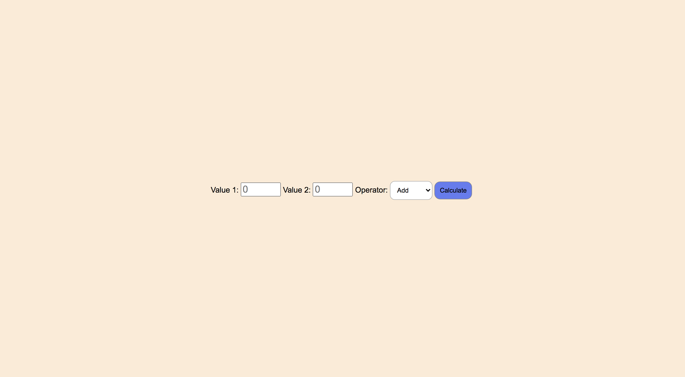

[![Contributors][contributors-shield]][contributors-url]
[![PR][pr-shield]][pr-url]
[![Issues][issues-shield]][issues-url]
[![Forks][forks-shield]][forks-url]
[![MIT License][license-shield]][license-url]

[contributors-shield]: https://img.shields.io/badge/1-Contributors%20-brightgreen
[contributors-url]: https://github.com/abelRoland/calculator-refactor/graphs/contributors
[forks-shield]: https://img.shields.io/badge/-Forks-blue
[forks-url]: https://github.com/abelRoland/calculator-refactor/network/members
[issues-shield]: https://img.shields.io/badge/-ISSUES-green
[issues-url]: https://github.com/abelRoland/calculator-refactor/issues
[pr-shield]: https://img.shields.io/badge/-Pull%20Requests%20-blueviolet
[pr-url]: https://github.com/abelRoland/calculator-refactor/pulls
[license-shield]: https://img.shields.io/badge/-LICENSE-red
[license-url]: https://github.com/abelRoland/calculator-refactor/blob/master/LICENSE

# Calculator Refactor

This repo is developed in order to train refactoring, organization of development process and concerning. 
Here is a preview of the page:

The indication on the original repository was:

* Follow [this tutorial from `mmtuts`](https://www.youtube.com/watch?v=qQEYAOPWDzk) and refactor your finished code into the files of this repository.  Be sure to organize your development process using Git Branches
> * To learn more about how to organize your code & how to write development-strategies for this project, you can study the [using-user-events exercises](https://github.com/hackyourfuturebelgium/using-user-events)
> * And of course, don't be limited by the tutorial!  It's just a starting point.  After making the base project work, follow your imagination
> * Branching: for this project you should organize your branches based on _concern_ instead of user story.  If you look in the `development-strategy` template file you will find that there are a series of tables, the code for each table should be developed on it's own branch.  You can also find information on what the branches should be called in the students/module overview app for your class, and the assignment in the week's README
